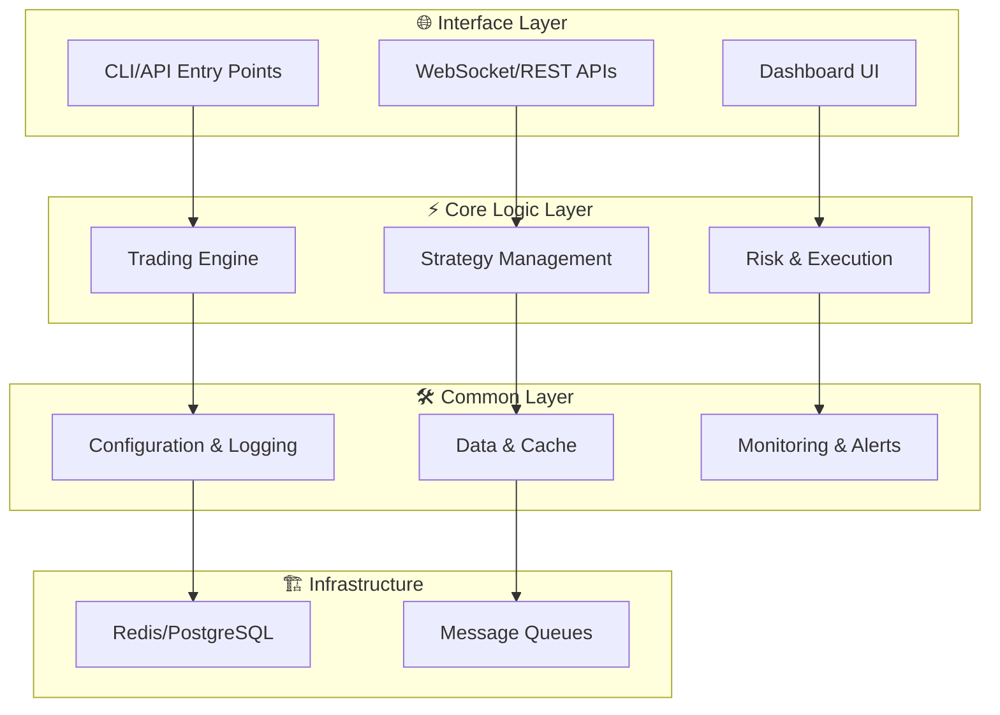

# SIGMA Architecture v1.4

## 1. Purpose & Scope

개인 VPS 한 대(4 vCPU / 16 GB)에서

* **실전 거래(LIVE)**
* **실시간 시뮬레이션(SIM)**
* **과거 백테스트(BACKTEST)**
  세 모드가 동일한 코드-경로로 동작하도록 설계한다.

---

## 2. Design Principles

1. 이벤트 기반 비동기(Redis Pub/Sub)
2. 전략·리스크·실행 **단일 책임 모듈**
3. “MVP → 확장” 단계적 복잡도 추가
4. **관찰성 기본 탑재** : Prometheus·Grafana·Alertmanager
5. Docker Compose 단일 호스트 → 필요 시 모듈별 컨테이너 분리

---

## 3. High-Level Diagram (Mermaid)

상세한 시스템 플로우차트는 별도 문서를 참조하세요: **[flowchart.md](./flowchart.md)**

**주요 특징:**
- **45개 모듈**이 4개 레이어로 구성
- **이벤트 기반 비동기 처리** (Redis Pub/Sub)
- **LIVE/SIM/BACKTEST** 모드에서 동일 코드 경로 사용
---

## 4. Component Catalog

| ID | Module | Mode(s) | 책임 |
| -- | --- | --- | --- |
| 1 | **run_bot.py:main** | ALL | CLI 진입점 |
| 2 | **backtest.py CLI** | BACKTEST | 백테스트 실행 |
| 3 | **WebSocket.receive_prices** | LIVE | 실시간 시세 수신 |
| 4 | **Redis.subscribe_price_update** | ALL | 가격 업데이트 구독 |
| 5 | **FastAPI.initApp** | ALL | REST/WS 서버 초기화 |
| 6 | **/ws endpoint** | ALL | 웹소켓 엔드포인트 |
| 7 | **ReactDashboard.useWebSocket** | ALL | 대시보드 실시간 표시 |
| 8 | **REST /api/orders,/api/pnl** | ALL | 주문·손익 API |
| 9 | **TradingBot** | ALL | 틱 처리·전략 호출 |
| 10 | **StrategyManager** | ALL | 전략 플러그인 실행 |
| 11 | **RiskManager** | ALL | 주문 검증 및 제한 |
| 12 | **OrderExecutor** | LIVE | 실계좌 주문 처리 |
| 13 | **SimulatorExecutor** | SIM/BACKTEST | 가상 체결 처리 |
| 14 | **StrategySelector** | ALL | 스케줄 기반 전략 교체 |
| 15 | **OptimizationModule** | ALL | 파라미터 최적화 |
| 16 | **TrendScanner** | ALL | 시장 추세 감지 |
| 17 | **PerformanceReporter** | ALL | 성과 리포트 생성 |
| 18 | **MLModule** | ALL | ML 기반 신호 보조 |
| 19 | **StrategyTester** | SIM/BACKTEST | 전략 테스트 |
| 20 | **NewsHandler** | ALL | 뉴스 이벤트 처리 |
| 21 | **AnomalyDetector** | ALL | 이상 징후 감지 |
| 22 | **DataCleaner** | ALL | 데이터 정제 |
| 23 | **CommentaryModule** | ALL | 코멘터리 생성 |
| 24 | **SystemStatus** | ALL | 서비스 상태 모니터링 |
| 25 | **config_loader.py** | ALL | 설정 파일 로드 |
| 26 | **infrastructure/db/session.py** | ALL | DB 세션 관리 |
| 27 | **infrastructure/db/models.py** | ALL | ORM 모델 정의 |
| 28 | **logger.py** | ALL | 로깅 설정 |
| 29 | **plugin_loader.py** | ALL | 플러그인 로드 |
| 30 | **metrics.py** | ALL | 지표 수집 모듈 |
| 31 | **user_prefs.py** | ALL | 사용자 설정 관리 |
| 32 | **health_check.py** | ALL | 상태 점검 |
| 33 | **cache.py** | ALL | 캐시 계층 |
| 34 | **additional_setup.py** | ALL | 초기 추가 설정 |
| 35 | **notification_service.py** | ALL | 알림 전송 |
| 36 | **api_service.py** | ALL | API 서비스 공통 모듈 |
| 37 | **event_loop.py** | ALL | 비동기 이벤트 루프 |
| 38 | **session_manager.py** | ALL | 세션 관리 |
| 39 | **logging_service.py** | ALL | 중앙 로그 수집 |
| 40 | **Redis Pub/Sub** | ALL | 메시지 브로커 |
| 41 | **RabbitMQ Queue** | ALL | 작업 큐 |
| 42 | **PostgreSQL** | ALL | 영속 데이터베이스 |
| 43 | **PaymentProcessor** | LIVE | 결제 처리 |
| 44 | **ReportRepository** | ALL | 리포트 저장소 |
| 45 | **DashboardAPI** | ALL | 실적 및 상태 조회 API |

자세한 모듈별 사양은 `docs/4_development/module_specs/` 이하 레이어별 하위 디렉터리를 참조하세요.
---

## 5. Data Flow & Sequence (high-level)
1. **DataSource**
   LIVE → MarketDataWebSocket, BACKTEST → HistoricalDataLoader
2. `market.tick` → Redis → **TradingBot**
3. TradingBot → StrategyManager → RiskManager → (OrderExecutor | SimulatorExecutor)
4. `order.fill` 이벤트 → TradingBot 잔고 갱신
5. StrategySelector·OptimizationModule 주기 실행 → StrategyManager 업데이트
6. TrendScanner 결과 게시 → Redis → StrategyManager 참조
7. PerformanceReporter·DashboardAPI 출력 → Grafana 대시보드
8. Alert 임계치 초과 → NotificationService → Slack

---

## 6. Non-Functional Requirements

| 항목            | 목표치                       | 비고                     |
| ------------- | ------------------------- | ---------------------- |
| **지연**        | 평균 ≤ 250 ms, P99 ≤ 600 ms | VPS 단일 호스트 왕복          |
| **RPO / RTO** | 5 분 / 30 분                | Postgres WAL·Redis AOF |
| **가용성**       | 99.5 % /월                 | 컨테이너 재시작 자동            |
| **보안**        | NAVER KMS 관리 키, 30 일 회전   | GitHub Actions OIDC    |
이 시스템은 `requirements/Server_Spec.md`에 명시된 단일 VPS 환경을 기준으로 설계되었습니다.

---

## 7. Deployment Topology

| 계층                | 컨테이너                                    | 비고                     |
| ----------------- | --------------------------------------- | ---------------------- |
| **App**           | `sigma-app` (모듈 run-via CLI arg)        | MODE=live/sim/backtest |
| **Data**          | `redis`, `postgres`, `rabbitmq`         | Named volume `db-data` |
| **Scheduler**     | `sigma-scheduler`                   | 전략 교체 및 리포트 cron |
| **Observability** | `prometheus`, `grafana`, `alertmanager` | dev · prod 공통          |
| **Dev-only**      | `sim_replay` (HD 전용), `sim_grafana`     | dev compose override   |

---

## 8. Glossary

| 용어       | 설명                           |
| -------- | ---------------------------- |
| **Tick** | 100 ms 단위 호가·체결 스냅샷          |
| **Fill** | 주문 체결 이벤트(계좌·수량·가격)          |
| **MODE** | live / sim / backtest 환경 스위치 |

---

## 9. Version History

| 버전       | 날짜         | 주요 변경                                                   |
| -------- | ---------- | ------------------------------------------------------- |
| v1.0     | 2025-05-21 | Baseline (거래 5 모듈)                                      |
| v1.1     | 2025-05-22 | Metrics·Notification·Dashboard 추가                       |
| v1.2 | 2025-05-22 | SimulatorExecutor · HistoricalDataLoader 통합, 다이어그램/표 갱신 |
| **v1.3** | 2025-05-23 | 3번 다이어그램 기반 전체 항목 개편 |
| **v1.4** | 2025-05-23 | DashboardAPI 모듈 추가 |

---
