# SIGMA 시스템 플로우차트

## 시스템 전체 데이터 흐름 다이어그램

```mermaid
flowchart TB
    %% 스타일 정의
    classDef interfaceClass fill:#e1f5fe,stroke:#01579b,stroke-width:2px
    classDef coreClass fill:#f3e5f5,stroke:#4a148c,stroke-width:2px
    classDef commonClass fill:#e8f5e8,stroke:#1b5e20,stroke-width:2px
    classDef infraClass fill:#fff3e0,stroke:#e65100,stroke-width:2px

    %% 인터페이스 레이어
    subgraph Interfaces["🌐 인터페이스 레이어 (Interface Layer)"]
        direction TB
        main["1️⃣ run_bot.py:main<br/>CLI 진입점"]
        backtestCLI["2️⃣ backtest.py CLI<br/>백테스트 실행"]
        wsReceive["3️⃣ WebSocket.receive_prices<br/>실시간 시세 수신"]
        wsSubscribe["4️⃣ Redis.subscribe_price_update<br/>가격 업데이트 구독"]
        fastApi["5️⃣ FastAPI.initApp<br/>REST/WS 서버"]
        wsEndpoint["6️⃣ /ws endpoint<br/>웹소켓 엔드포인트"]
        reactDashboard["7️⃣ ReactDashboard.useWebSocket<br/>대시보드 UI"]
        restApi["8️⃣ REST /api/orders,/api/pnl<br/>주문·손익 API"]
    end

    %% 핵심 로직 레이어
    subgraph Core["⚡ 핵심 로직 레이어 (Core Logic Layer)"]
        direction TB
        tradingBot["9️⃣ TradingBot<br/>틱 처리·전략 호출"]
        strategyManager["🔟 StrategyManager<br/>전략 플러그인 실행"]
        riskManager["1️⃣1️⃣ RiskManager<br/>주문 검증 및 제한"]
        orderExecutor["1️⃣2️⃣ OrderExecutor<br/>실계좌 주문 처리"]
        simulatorExecutor["1️⃣3️⃣ SimulatorExecutor<br/>가상 체결 처리"]
        strategySelector["1️⃣4️⃣ StrategySelector<br/>스케줄 기반 전략 교체"]
        optimizationModule["1️⃣5️⃣ OptimizationModule<br/>파라미터 최적화"]
        trendScanner["1️⃣6️⃣ TrendScanner<br/>시장 추세 감지"]
        performanceReporter["1️⃣7️⃣ PerformanceReporter<br/>성과 리포트 생성"]
        mlModule["1️⃣8️⃣ MLModule<br/>ML 기반 신호"]
        strategyTester["1️⃣9️⃣ StrategyTester<br/>전략 테스트"]
        newsHandler["2️⃣0️⃣ NewsHandler<br/>뉴스 이벤트 처리"]
        anomalyDetector["2️⃣1️⃣ AnomalyDetector<br/>이상 징후 감지"]
        dataCleaner["2️⃣2️⃣ DataCleaner<br/>데이터 정제"]
        commentaryModule["2️⃣3️⃣ CommentaryModule<br/>코멘터리 생성"]
        systemStatus["2️⃣4️⃣ SystemStatus<br/>서비스 상태 모니터링"]
    end

    %% 공통 & 인프라 레이어
    subgraph Common["🛠️ 공통 & 인프라 레이어 (Common & Infrastructure Layer)"]
        direction TB
        configLoader["2️⃣5️⃣ config_loader.py<br/>설정 파일 로드"]
        dbSession["2️⃣6️⃣ db/session.py<br/>DB 세션 관리"]
        dbModels["2️⃣7️⃣ db/models.py<br/>ORM 모델 정의"]
        logger["2️⃣8️⃣ logger.py<br/>로깅 설정"]
        pluginLoader["2️⃣9️⃣ plugin_loader.py<br/>플러그인 로드"]
        metrics["3️⃣0️⃣ metrics.py<br/>지표 수집"]
        userPrefs["3️⃣1️⃣ user_prefs.py<br/>사용자 설정"]
        healthCheck["3️⃣2️⃣ health_check.py<br/>상태 점검"]
        cache["3️⃣3️⃣ cache.py<br/>캐시 계층"]
        additionalSetup["3️⃣4️⃣ additional_setup.py<br/>초기 추가 설정"]
        notificationService["3️⃣5️⃣ notification_service.py<br/>알림 전송"]
        apiService["3️⃣6️⃣ api_service.py<br/>API 서비스 공통"]
    end

    %% 외부 인프라
    subgraph Infrastructure["🏗️ 외부 인프라 (External Infrastructure)"]
        direction TB
        redisPub["Redis Pub/Sub<br/>메시지 브로커"]
        rabbitMQ["RabbitMQ Queue<br/>작업 큐"]
        postgreSQL["PostgreSQL<br/>영속 데이터베이스"]
        paymentProcessor["PaymentProcessor<br/>결제 처리"]
        reportRepo["ReportRepository<br/>리포트 저장소"]
    end

    %% 스타일 적용
    class main,backtestCLI,wsReceive,wsSubscribe,fastApi,wsEndpoint,reactDashboard,restApi interfaceClass
    class tradingBot,strategyManager,riskManager,orderExecutor,simulatorExecutor,strategySelector,optimizationModule,trendScanner,performanceReporter,mlModule,strategyTester,newsHandler,anomalyDetector,dataCleaner,commentaryModule,systemStatus coreClass
    class configLoader,dbSession,dbModels,logger,pluginLoader,metrics,userPrefs,healthCheck,cache,additionalSetup,notificationService,apiService commonClass
    class redisPub,rabbitMQ,postgreSQL,paymentProcessor,reportRepo infraClass

    %% 🚀 시스템 초기화 플로우
    main -->|초기화| configLoader
    configLoader -->|설정 로드| dbSession
    dbSession -->|세션 생성| dbModels
    main -->|로깅 설정| logger
    logger -->|플러그인 로드| pluginLoader
    pluginLoader -->|상태 점검| healthCheck
    healthCheck -->|캐시 초기화| cache
    cache -->|추가 설정| additionalSetup
    additionalSetup -->|지표 수집| metrics
    metrics -->|알림 서비스| notificationService
    notificationService -->|API 서비스| apiService

    %% 📡 실시간 데이터 플로우 (LIVE/SIM)
    wsReceive -->|실시간 시세| redisPub
    redisPub -->|가격 업데이트| tradingBot
    tradingBot -->|전략 실행| strategyManager
    strategyManager -->|주문 신호| riskManager
    riskManager -->|승인된 주문| orderExecutor
    riskManager -->|가상 주문| simulatorExecutor
    orderExecutor -->|실행 결과| redisPub
    simulatorExecutor -->|시뮬 결과| redisPub

    %% 🧠 전략 관리 플로우
    strategySelector -->|전략 선택| strategyManager
    strategySelector -->|최적화 요청| optimizationModule
    optimizationModule -->|최적화 결과| strategyManager
    mlModule -->|ML 신호| strategyManager
    newsHandler -->|뉴스 이벤트| strategyManager
    trendScanner -->|추세 분석| strategyManager

    %% 🔍 백테스트 플로우
    backtestCLI -->|테스트 실행| strategyTester
    strategyTester -->|전략 호출| strategyManager
    strategyManager -->|가상 실행| simulatorExecutor
    simulatorExecutor -->|결과 저장| postgreSQL
    strategyTester -->|리포트 생성| performanceReporter
    performanceReporter -->|분석 저장| reportRepo

    %% 🌐 대시보드 플로우
    fastApi -->|웹소켓 초기화| wsEndpoint
    wsEndpoint -->|구독 설정| wsSubscribe
    wsSubscribe -->|실시간 업데이트| reactDashboard
    fastApi -->|REST API| restApi
    restApi -->|주문 조회| orderExecutor
    restApi -->|상태 조회| systemStatus
    systemStatus -->|시스템 정보| apiService

    %% 📊 모니터링 & 알림 플로우
    tradingBot -->|성능 지표| metrics
    tradingBot -->|로그 기록| logger
    anomalyDetector -->|이상 감지| notificationService
    healthCheck -->|상태 점검| notificationService
    performanceReporter -->|성과 리포트| notificationService

    %% 💾 데이터 저장 플로우
    orderExecutor -->|주문 기록| postgreSQL
    simulatorExecutor -->|시뮬 기록| postgreSQL
    dataCleaner -->|정제 데이터| postgreSQL
    trendScanner -->|추세 데이터| postgreSQL
    performanceReporter -->|성과 데이터| postgreSQL
    commentaryModule -->|코멘터리| reportRepo

    %% 🔧 설정 & 사용자 관리
    configLoader -->|사용자 설정| userPrefs
    userPrefs -->|설정 캐시| cache
    pluginLoader -->|플러그인 관리| strategyManager

    %% 🔄 외부 결제 플로우 (LIVE 모드)
    orderExecutor -->|결제 처리| paymentProcessor
    paymentProcessor -->|결제 결과| postgreSQL
```

## 주요 데이터 흐름 설명

### 1. 🚀 시스템 초기화 (System Initialization)
1. **run_bot.py:main** 진입점에서 시작
2. **config_loader** → **db/session** → **db/models** 순서로 기본 인프라 설정
3. **logger** → **plugin_loader** → **health_check** → **cache** → **metrics** 순서로 공통 서비스 초기화

### 2. 📡 실시간 거래 (Real-time Trading Flow)
1. **WebSocket.receive_prices**가 실시간 시세를 **Redis Pub/Sub**에 게시
2. **TradingBot**이 가격 업데이트를 구독하여 전략 실행
3. **StrategyManager** → **RiskManager** → **OrderExecutor/SimulatorExecutor** 순서로 주문 처리
4. 실행 결과를 다시 **Redis**에 게시하여 다른 모듈들이 참조

### 3. 🧠 전략 관리 (Strategy Management)
1. **StrategySelector**가 스케줄에 따라 전략 교체
2. **OptimizationModule**이 파라미터 최적화 수행
3. **MLModule**, **NewsHandler**, **TrendScanner**가 보조 신호 제공
4. 모든 신호가 **StrategyManager**로 집약

### 4. 🔍 백테스트 (Backtesting Flow)
1. **backtest.py CLI**에서 시작
2. **StrategyTester** → **StrategyManager** → **SimulatorExecutor** 순서로 가상 거래
3. **PerformanceReporter**가 결과 분석 및 리포트 생성
4. **PostgreSQL**과 **ReportRepository**에 결과 저장

### 5. 🌐 대시보드 (Dashboard Flow)
1. **FastAPI**가 웹 서버 및 웹소켓 엔드포인트 제공
2. **ReactDashboard**가 실시간 데이터 구독
3. **REST API**를 통해 주문 조회, 시스템 상태 확인

### 6. 📊 모니터링 & 알림 (Monitoring & Alerts)
1. **AnomalyDetector**, **HealthCheck**가 시스템 상태 감시
2. **Metrics** 모듈이 성능 지표 수집
3. **NotificationService**가 임계치 초과 시 알림 전송

이 플로우차트는 45개 모듈 간의 복잡한 상호작용을 시각화하여 시스템 전체의 데이터 흐름과 의존성을 명확하게 보여줍니다.
