# 운영 매뉴얼

시스템 모니터링과 장애 대응 절차를 정리한 문서입니다.

## 1. 모니터링
- `htop` 또는 `btop`을 사용해 CPU와 메모리 사용량을 실시간으로 확인합니다.
- 로그 파일을 주기적으로 점검해 오류 여부를 확인합니다.

## 2. 장애 대응 절차
1. 서비스 상태 확인
   ```bash
   docker compose ps
   ```
2. 이상이 있는 컨테이너 재시작
   ```bash
   docker compose restart api
   ```
3. Redis 장애 시 데이터 백업본으로 복구합니다.

## 3. 백업 정책
- `sigma_system.yaml` 등 주요 설정 파일을 주기적으로 백업합니다.
- Redis의 `dump.rdb` 파일을 안전한 위치에 보관합니다.

시스템 전반 구조는 다음 다이어그램을 참고하십시오.



## 4. API 관리 기능

`/token` 엔드포인트에서 관리자 계정으로 토큰을 발급받으면 아래 API를 사용할 수 있습니다. 발급된 토큰은 기본적으로 15분 후 만료되며 만료된 경우 `/token` 엔드포인트를 통해 갱신해야 합니다.

- `/strategies` : 등록된 전략 목록 조회 및 수정
- `/system/tasks` : 실행 중인 작업 확인
- `/backtests` : 백테스트 결과 조회
- `/notify` : 실시간 알림 전송. `message` 파라미터는 쿼리 문자열로 전달됩니다 (예: `/notify?message=Hello`). 전송된 알림은 WebSocket 구독자에게도 전달됩니다.
