# 전략 추가 가이드

새로운 매매 전략을 SIGMA-X에 통합하는 방법을 설명합니다.

## 1. 전략 모듈 작성
`src/` 디렉터리에 `BaseStrategy`를 상속한 클래스를 정의합니다. 예시:

```python
from src.strategy import BaseStrategy

class MyStrategy(BaseStrategy):
    async def process(self, price: float) -> str:
        # 여기서 매매 로직을 구현합니다.
        return "HOLD"
```

## 2. TradeExecutor에 주입
`TradeExecutor` 생성 시 `strategy` 인자로 전달해 사용합니다.

```python
from src.trade_executor import TradeExecutor
from src.my_strategy import MyStrategy

executor = TradeExecutor(strategy=MyStrategy())
await executor.run()
```

## 3. 테스트 추가
새 전략에 대한 단위 테스트를 `tests/` 폴더에 작성해 동작을 검증합니다.

아래 클래스 다이어그램을 참고하면 모듈 구조를 이해하는 데 도움이 됩니다.


